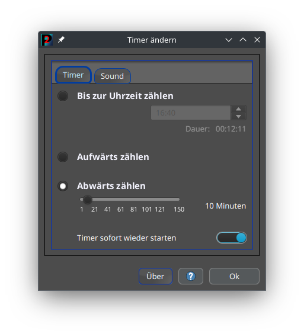

[](http://www.gnu.org/licenses/gpl-3.0)

# P2Timer

P2Timer ist ein kleiner "Timer". Damit kann man sich regelmäßig erinnern lassen. Es wird eine Zeitspanne von z.B. 30 Minuten vorgegeben, dann "läutet" der Timer alle 30 Minuten und ich werde z.B. daran erinnert, mich mal wieder zu bewegen. Weiterhin ist es auch möglich, eine Uhrzeit vorzugeben. Dann kann ich mich z.B. an den Tatort um 20:15 Uhr erinnern lassen. Desweiteren kann ich auch die Zeit messen, die ich z.B. auf dem Hometrainer radele.

<br />

Das ist die Programmoberfläche. Mit einem Klick auf die Programmoberfläche kann das Programm auf dem Bildschirm verschoben werden. Das Programm merkt sich die letzte Position, und startet dann an der Stelle beim nächsten Start.


Wird die Programmoberfläche mit der Maus überfahren, werden die Einstellungen angezeigt. Hier kann der Timer gestartet, gestoppt oder pausiert werden. Das Zahnrad öffnet den Einstellungsdialog und der letzte Button beendet das Programm.


Im Einstellungs-Dialog kann dann ausgeswählt werden, was der Timer machen soll: Aufwärts/abwärts zählen oder die Einstellung einer Uhrzeit. Es kann auch ein Sound ausgeswählt werden, der dann beim Erreichen der Uhrzeit / Zeitspanne abgespielt wird.




## Infos

Das Programm nutzt den Ordner ".p2Timer" unter Linux und den versteckten Ordner "p2Timer" unter Windows als
Konfig-Ordner. Man kann dem Programm auch einen Ordner für die Einstellungen mitgeben (und es z.B. auf einem USB-Stick
verwenden):

```
java -jar P2Timer.jar ORDNER
```
<br />

## Systemvoraussetzungen

Unterstützt wird Windows und Linux.

Das Programm benötigt unter Windows und Linux eine aktuelle Java-VM ab Version: Java 17. Für Linux-Benutzer wird
OpenJDK empfohlen. (FX-Runtime bringt das Programm bereits mit und muss nicht installiert werden).
<br />

## Download

Das Programm wird in drei Paketen angeboten. Diese unterscheiden sich nur im "Zubehör", das Programm selbst ist in allen
Paketen identisch:

- **P2Timer-XX.zip**  
  Das Programmpaket bringt nur das Programm und die benötigten "Hilfsprogramme" aber kein Java mit. Auf dem Rechner muss
  eine Java-Laufzeitumgebung ab Java17 installiert sein. Dieses Programmpaket kann auf allen Betriebssystemen verwendet
  werden. Es bringt Startdateien für Linux und Windows mit.

- **P2Timer-XX__Linux+Java.zip**  
  **P2Timer-XX__Win+Java.zip**  
  Diese Programmpakete bringen die Java-Laufzeitumgebung mit und sind nur für das angegebene Betriebssystem: Linux oder
  Windows. Es muss kein Java auf dem System installiert sein. (Die Java-Laufzeitumgebung liegt im Ordner "Java" und
  kommt von jdk.java.net).

zum Download: [github.com/xaverW/P2Timer/releases](https://github.com/xaverW/P2Timer/releases)
<br />

## Website

[www.p2tools.de/]( https://www.p2tools.de)
